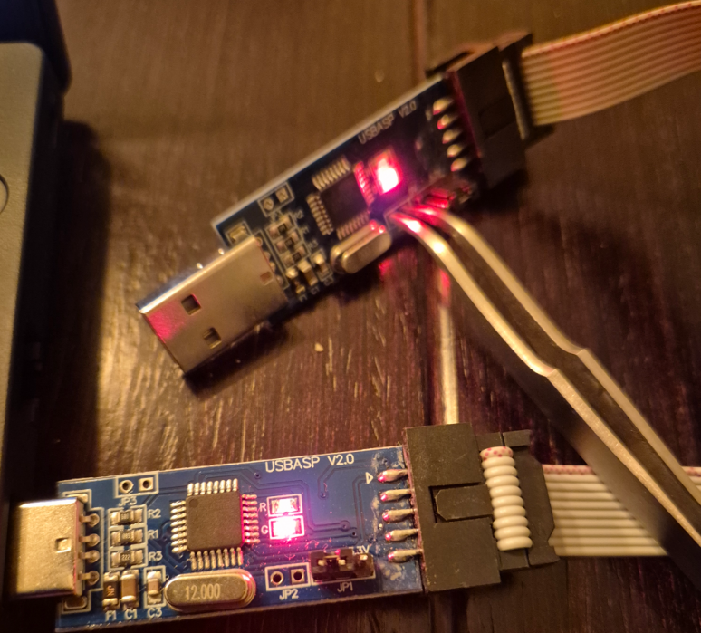
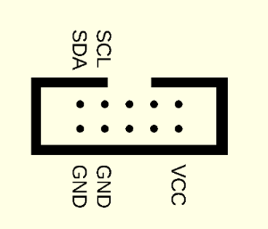
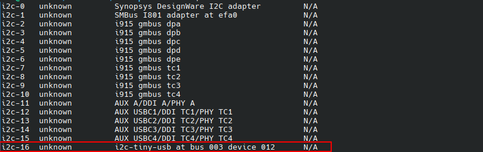

# i2c-tiny-usbasp

Fork of the [i2c-tiny-usb](https://github.com/harbaum/I2C-Tiny-USB) project for use on [USBasp](https://www.fischl.de/usbasp/) hardware.

## Notes

Tested on a cheap (atmega8 based) USBasp V2 board which is available on many selling portals.

This repository contains only the modified firmware with [usbtiny](https://dicks.home.xs4all.nl/avr/usbtiny/) stack.
`firmware/firmware.hex` is a precompiled version you can use to flash your USBasp board.

Modifications done:
- removed all usb stacks excepting usbtiny
- updated usbtiny stack (v1.7) with fast CRC enabled
- two LEDs configured for "USB OK" and "USB TX" notifications
- updated LED on/off control in usbtiny
- removed attiny45 code
- updated USB D+ D- pins to fit USBasp hardware (D+ is PB1, D- is PB0)
- updated I2C pins to fit USBasp hardware (SCL is PB5, SDA is PB4)
- removed all makefiles excepting one for USBasp with atmega8
- updated Makefile to use python3 for check.py
- updated usbtiny makefile to build firmware.hex instead of main.hex
- `make flash` will flash without building

## Compiling the firmware

- Install AVR GCC toolchain. Under Ubuntu/Debian you can use following command: `sudo apt install avr-libc binutils-avr gcc-avr avrdude make`
- clone this repository and change working directory in terminal to `firmware` subfolder
- run `make` to build

## Uploading the firmware

Easiest way to program the USBasp board with the i2c-tiny-usb firmware is to use another USBasp board.

- Bridge the JP2 `Self program` pins of the target USBasp device
- Connect another USBasp device (as programmer) to the target board
- Put the programmer USBasp into USB port of your PC
- run `make flash` from `firmware` subfolder to flash firmware.hex to the target USBasp
- remove JP2 `Self program` bridge

## Pinout

## Testing (Linux)

- Connect the flashed USBasp device to your linux machine
- install `i2c-tools` package (e.g. `sudo apt install i2c-tools`)
- run `i2cdetect -l`, i2-tiny-usb interface should be listed

